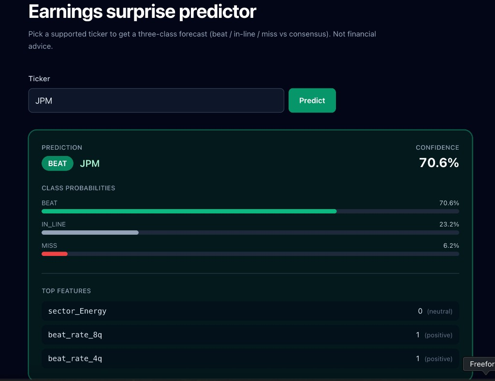
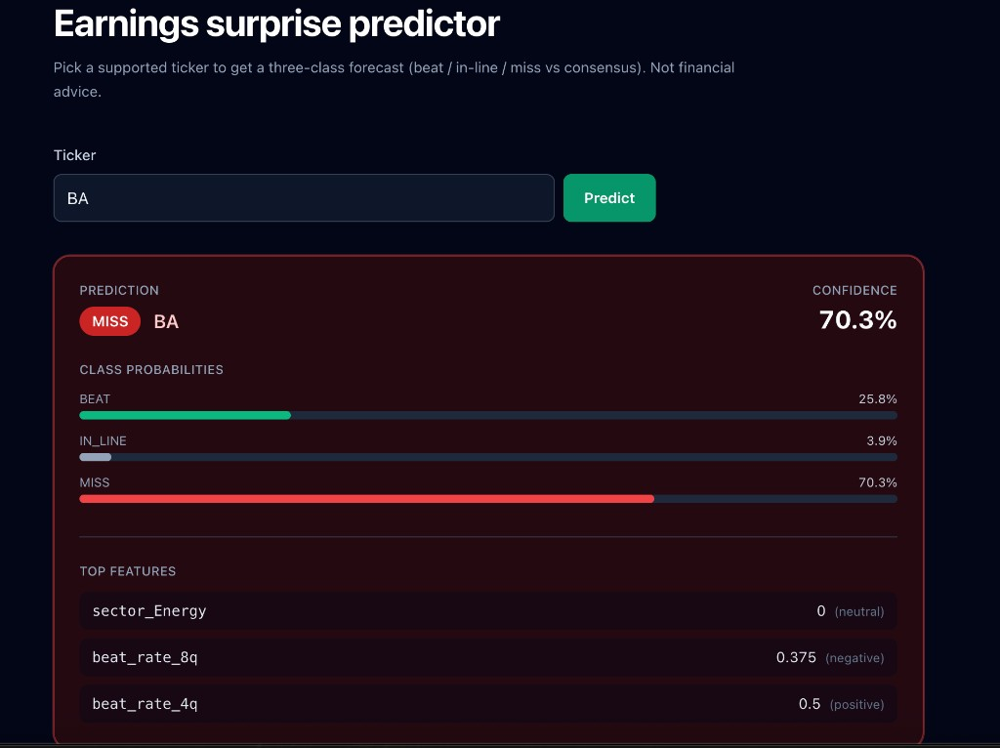
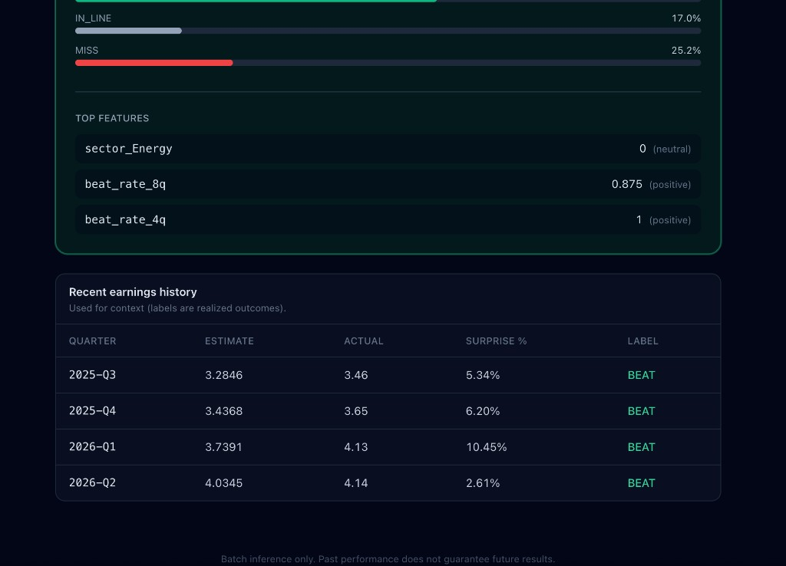
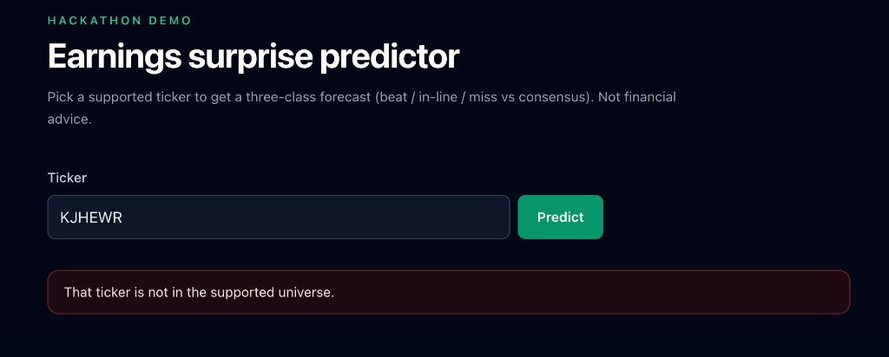
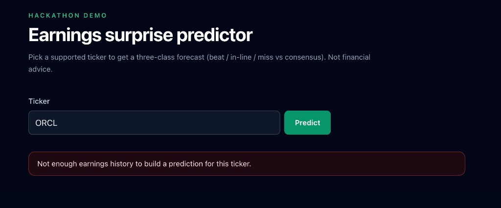

# Earnings Surprise Predictor

**Hackathon demo** — a small web app and API that estimate whether a company’s **next** earnings report is more likely to **beat**, **miss**, or land **in-line** with Wall Street EPS consensus, using only information available **before** the release (point-in-time features). **Not financial advice.**

## What this project is

Markets already bake expectations into prices; this tool does **not** predict stock returns. It focuses on the **surprise** dimension: given history, price behavior, sector context, and recent headline sentiment (via **FinBERT** on pre-earnings news), a **multiclass XGBoost** model outputs probabilities for beat / in-line / miss. The training pipeline uses a **fixed universe** of large-cap tickers (to stay within **Finnhub** rate limits), **time-based splits** so the model is not evaluated on random shuffles of the past, and labels derived from reported vs consensus EPS with a configurable band around “in-line.”

**Stack:** **Finnhub** (earnings history, news), **yfinance** (prices, sector, calendar backfill), **Hugging Face Inference** (FinBERT sentiment), **FastAPI** (JSON API + `x-api-key` auth on predict), **React + Vite + Tailwind + Recharts** (dark UI). For endpoints, feature lists, and design choices, see [plan.md](plan.md).

---

## Screenshots

### Prediction card (example: beat)

The main view shows the predicted class, confidence (probability of the argmax class), per-class probabilities, and a short list of **top features** the API returns for transparency (e.g. historical beat rates, sector one-hots).



### Another ticker (example: miss)

The same layout applies when the model favors **MISS** — colors follow outcome (green beat, gray in-line, red miss).



### History and explanations

Below the card, the UI can show **recent realized quarters** (estimate, actual, surprise %, label) so judges or users can sanity-check the model against history, alongside the same **top features** block.



### Validation and data limits

Unsupported tickers are rejected with a clear message (the app only knows the configured universe). Tickers with **too few quarters** of clean history return a friendly error instead of a bogus forecast.





---

## Prerequisites

- **Python** 3.11+ (3.12 used in Docker)
- **Node** 20+ (for local frontend dev)
- API keys: **Finnhub**, **Hugging Face** (Inference Providers), plus an app **API_KEY** you choose for the FastAPI `x-api-key` header

## Setup

1. Clone the repo and create a root `.env`:

   ```bash
   cp .env.example .env
   ```

2. Edit `.env` and set `FINNHUB_API_KEY`, `HF_API_KEY`, `API_KEY`, and `VITE_API_KEY` (use the **same** value for `VITE_API_KEY` and `API_KEY` so the Vite app can call `/api` in development).

3. Create a virtual environment and install Python dependencies:

   ```bash
   python -m venv .venv
   source .venv/bin/activate   # Windows: .venv\Scripts\activate
   pip install -r requirements-api.txt
   ```

4. Install frontend dependencies:

   ```bash
   cd frontend && npm ci && cd ..
   ```

## Data pipeline and training (run before the demo)

Run these **on the host** (or in a one-off container) so `data/` and `models/` are populated. Docker Compose **mounts** those folders but does not build them automatically.

```bash
python -m src.ingestion
python -m src.features
python -m src.train
```

Ensure `models/xgb_classifier.joblib` and `models/train_metadata.json` exist after training.

## Local development (no Docker)

**Terminal 1 — API**

```bash
source .venv/bin/activate
uvicorn api.main:app --reload --host 127.0.0.1 --port 8000
```

**Terminal 2 — Frontend**

```bash
cd frontend
npm run dev
```

Open `http://127.0.0.1:5173`. The Vite dev server proxies `/api` to `http://127.0.0.1:8000`.

## Docker

Use **Docker Compose** from the **repository root** so paths and `env_file` resolve correctly.

1. Ensure `.env` exists and `data/` + `models/` contain artifacts (see above).

2. Build and start:

   ```bash
   docker compose up --build
   ```

3. Open the UI at **http://127.0.0.1:5173** and the API at **http://127.0.0.1:8000** (e.g. `GET /api/health`).

**Mounts**

- `./data` → `/app/data` — processed data, features, sentiment cache
- `./models` → `/app/models` — trained `joblib` + `train_metadata.json`

Edits on the host under `data/` and `models/` are visible inside the backend container without rebuilding.

**Frontend proxy in Docker**

The Vite config reads `VITE_API_PROXY_TARGET` (default `http://127.0.0.1:8000` for local dev). Compose sets it to `http://backend:8000` so browser requests to `/api` are proxied to the `backend` service on the Docker network.

## API authentication

Send header `x-api-key: <your API_KEY>` on `POST /api/predict`. Health and ticker list endpoints are unauthenticated in line with the project’s Phase 5 behavior; adjust in `api/main.py` if you need stricter access.

## Troubleshooting

- **503 on predict / model not loaded** — Missing `models/` artifacts, wrong Python env without `xgboost`, or corrupt `joblib`. Train again and confirm files exist under `./models` on the host (mounted into the container).
- **401 on predict** — `x-api-key` must match `API_KEY` in `.env`.
- **Empty or stale data** — Re-run ingestion and feature steps; Finnhub has rate limits (~60 calls/minute).

## License / disclaimer

Educational / hackathon use only. Past performance does not guarantee future results.
